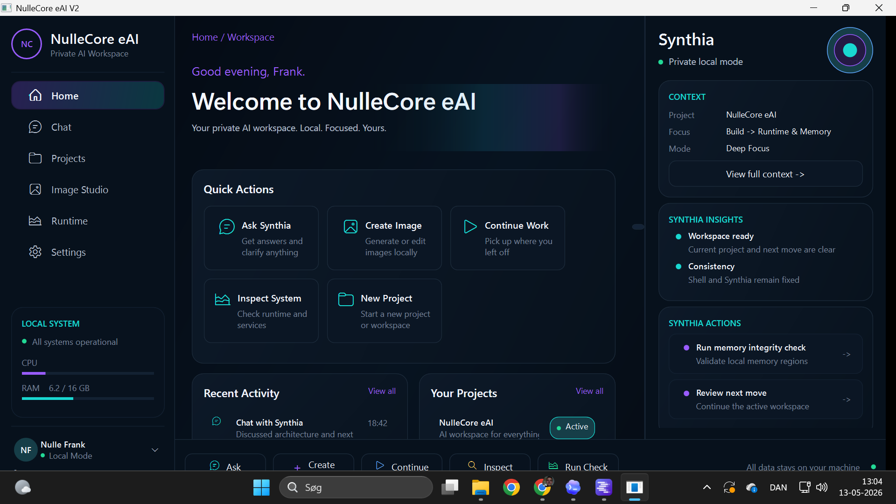
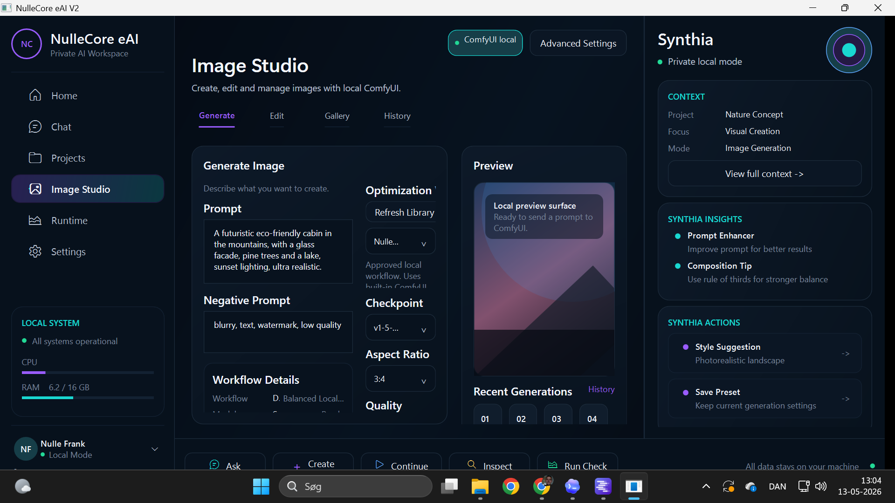

# NulleCore-eAI

Local-first AI creative workstation for Windows focused on offline orchestration, workflow readiness, image pipelines, and controlled local AI integrations.

**Status:** Public Alpha Preview  
**Alpha warning:** This is an unsigned alpha build intended for testing and technical evaluation.

## Overview

NulleCore-eAI is a curated desktop showcase for local AI workspace operations.  
It focuses on controlled runtime readiness, workflow execution structure, and practical local-first usage on Windows.

## Feature Highlights

- Windows desktop runtime experience
- Local-first architecture with user-controlled runtime setup
- LM Studio connectivity/readiness support
- ComfyUI connectivity/readiness support
- Workflow-oriented structure for image operations
- Modular orchestration foundation
- Curated release packaging (MSI + ZIP + checksums)

## Screenshots

Additional views:
- [Chat](screenshots/02-chat.png)
- [Projects Overview](screenshots/03-projects-overview.png)
- [Runtime Overview](screenshots/05-runtime-overview.png)
- [Settings General](screenshots/06-settings-general.png)

## Downloads / Releases

- Latest alpha release: [v0.1.0-alpha](https://github.com/tegllundj-dotcom/NulleCore-eAI/releases/tag/v0.1.0-alpha)
- Release notes: [docs/RELEASE_NOTES_v0.1.0-alpha.md](docs/RELEASE_NOTES_v0.1.0-alpha.md)
- Release verification log: [docs/RELEASE_VERIFICATION.md](docs/RELEASE_VERIFICATION.md)
- Release assets:
  - `NulleCore-eAI-Setup-v0.1.0-alpha.msi`
  - `NulleCore-eAI-v0.1.0-alpha-win-x64.zip`
  - `CHECKSUMS.txt`

Before install, verify integrity using [CHECKSUMS.txt](CHECKSUMS.txt).

## Local-first Philosophy

- No forced cloud dependency for the showcase runtime model
- User-controlled local runtime choices
- External AI runtimes remain separate tools managed by the user
- Controlled exposure and curated workflow examples

## Safety & Privacy

- Designed for local-first operation on user-controlled hardware
- Do not share secrets, private logs, tokens, or credentials in public issue reports
- Verify checksums before running installers or binaries
- Read [SECURITY.md](SECURITY.md) before reporting issues

## Current Limitations

- Alpha preview quality; behavior may change between releases
- Installer is currently unsigned
- External runtimes (LM Studio/ComfyUI) require user setup
- Workflow packs are still evolving and intentionally curated

## Runtime Notes

- LM Studio and ComfyUI are optional external dependencies
- NulleCore-eAI does not replace those tools
- Connectivity/readiness behavior depends on local runtime availability
- See setup docs:
  - [docs/lm-studio-setup.md](docs/lm-studio-setup.md)
  - [docs/comfyui-setup.md](docs/comfyui-setup.md)
  - [docs/local-ai-setup.md](docs/local-ai-setup.md)

## Roadmap

Near-term focus:
- Signed installer and release hardening
- Improved onboarding and runtime guidance
- Curated workflow packs and governance expansion
- Better diagnostics and execution approval controls
- Documentation quality improvements

See [ROADMAP.md](ROADMAP.md) for the public roadmap.

## Feedback & Issues

- Start testing flow: [What To Test First](https://github.com/tegllundj-dotcom/NulleCore-eAI/issues/3)
- Community thread: [Community Testing Hub](https://github.com/tegllundj-dotcom/NulleCore-eAI/issues/1)
- Known limits tracker: [Known Limitations](https://github.com/tegllundj-dotcom/NulleCore-eAI/issues/2)
- Launch announcement: [Public alpha call for testers](https://github.com/tegllundj-dotcom/NulleCore-eAI/issues/4)

## License

All rights reserved. See [LICENSE.md](LICENSE.md).
